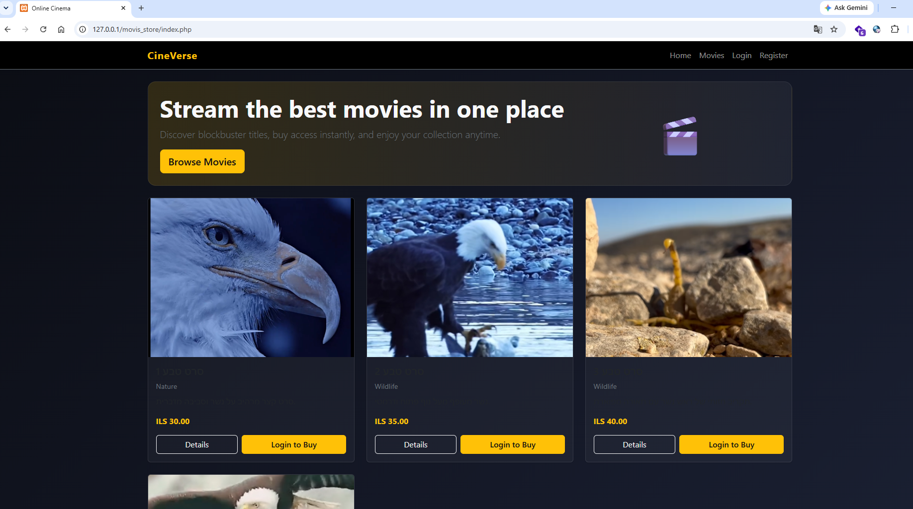
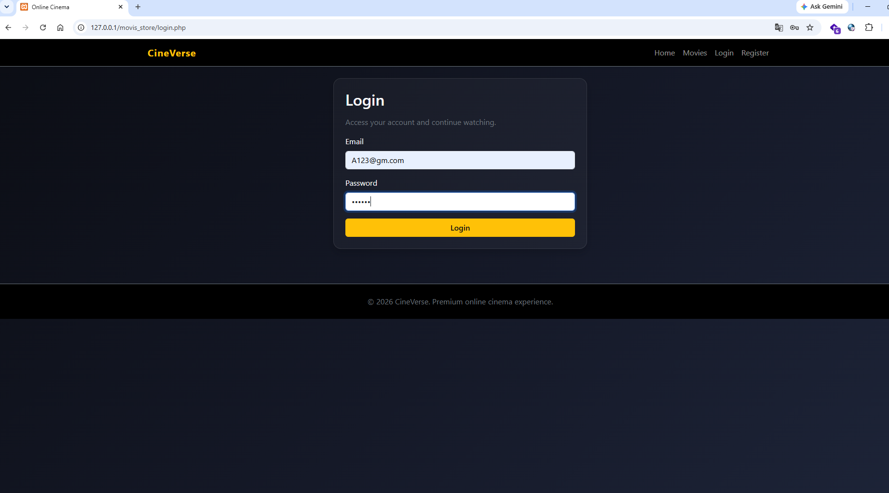
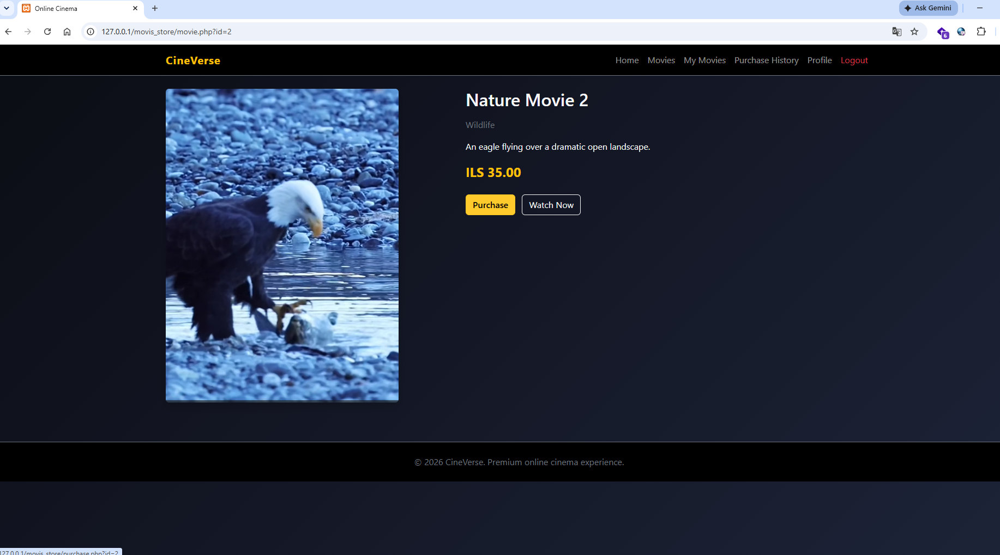
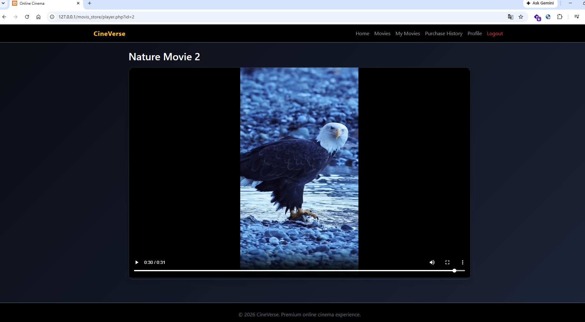

# 🎬 CineVerse - Online Cinema Management System


## 📌 Project Overview

**CineVerse** is a web-based online cinema management and streaming system developed using **PHP and MySQL**.

The system allows users to create accounts, browse available movies, purchase digital content, and watch purchased movies through a controlled access system.

This project was developed as part of a **Web Development and Web Security course** and demonstrates backend development, database management, user authentication, session handling, and basic application security practices.

---

# 🚀 Main Features

## 👤 User Management

* User registration and login system.
* Secure password storage using password hashing.
* Session-based authentication.
* User profile management.
* Personal movie library.

---

## 🎞️ Movie Management

* Browse available movies.
* View movie information and details.
* Purchase movies using a virtual balance system.
* Access purchased movies only.
* Watch movies through an integrated player page.

---

## 💳 Purchase System

* Virtual wallet balance.
* Purchase validation.
* Prevention of duplicate purchases.
* Purchase history tracking.
* User-specific purchased content.

---

# 🔐 Security Features

The project implements several security concepts:

* PDO Prepared Statements to reduce SQL Injection risks.
* Password hashing using PHP built-in security functions.
* Session-based authorization.
* Protected pages for authenticated users.
* Server-side input validation.
* Access control for purchased content.

---

# 📸 Screenshots & Demo

Add screenshots of the system:

## Homepage



---

## Login Page



---

## Movie Details & Purchase



---

## Movie Player



---

# 🛠️ Technologies Used

| Technology  | Purpose                       |
| ----------- | ----------------------------- |
| PHP         | Backend development           |
| MySQL       | Database management           |
| PDO         | Secure database communication |
| HTML5       | Page structure                |
| CSS3        | Website styling               |
| JavaScript  | Client-side functionality     |
| Bootstrap 5 | Responsive design             |
| XAMPP       | Local development environment |

---

# 📂 Project Structure

```
movis_store/
│
├── css/
│   └── style.css
│
├── database/
│   └── database.sql
│
├── includes/
│   ├── auth.php
│   ├── db.php
│   ├── footer.php
│   ├── functions.php
│   └── header.php
│
├── js/
│   └── main.js
│
├── screenshots/
│   └── [System Screenshots]
│
├── uploads/
│   ├── posters/
│   └── videos/
│
├── index.php
├── movies.php
├── movie.php
├── purchase.php
├── my_movies.php
├── history.php
├── profile.php
├── login.php
├── register.php
└── README.md
```

---

# ⚙️ Installation & Setup

## Requirements

Before running the project, install:

* XAMPP
* PHP 8+
* MySQL
* Web Browser

---

## Installation Steps

### 1. Clone the repository

```bash
git clone https://github.com/meklon101/movis_store.git
```

---

### 2. Move the project

Copy the project folder into:

```
C:\xampp\htdocs\
```

---

### 3. Start XAMPP

Run:

* Apache
* MySQL

---

### 4. Import Database

Open:

```
http://localhost/phpmyadmin
```

Create/import the database using:

```
database/database.sql
```

---

### 5. Configure Database Connection

Update your database settings inside the configuration file according to your local environment.

Example:

```
Database name:
online_cinema
```

---

### 6. Run the Project

Open:

```
http://localhost/movis_store/
```

---

# 🗄️ Database Design

The system uses a MySQL relational database.

Main tables:

## Users Table

Stores user information:

* User ID
* Username
* Email
* Password Hash
* Account Balance

---

## Movies Table

Stores movie information:

* Movie ID
* Title
* Description
* Category
* Price
* Poster
* Video Information

---

## Purchases Table

Stores user transactions:

* Purchase ID
* User ID
* Movie ID
* Purchase Date
* Purchase Price

---

# 🏗️ Application Flow

```
User
 |
 |---- Register / Login
 |
PHP Application
 |
 |---- Authentication
 |---- Authorization
 |---- Movie Management
 |---- Purchase System
 |
PDO
 |
MySQL Database
```

---

# 🔮 Future Improvements

Possible improvements:

* Admin dashboard.
* Online payment integration.
* Advanced user roles.
* Improved file upload security.
* REST API implementation.
* Docker deployment.
* Automated testing.

---

# 👨‍💻 Author

**meklon101**
- GitHub: [meklon101](https://github.com/meklon101)

---

# 📄 License

This project was created for educational purposes.
